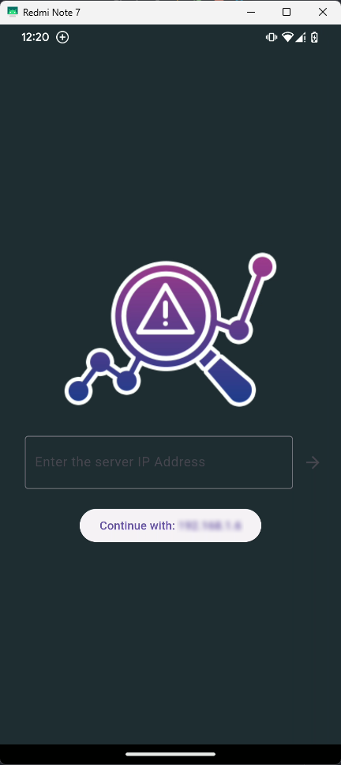
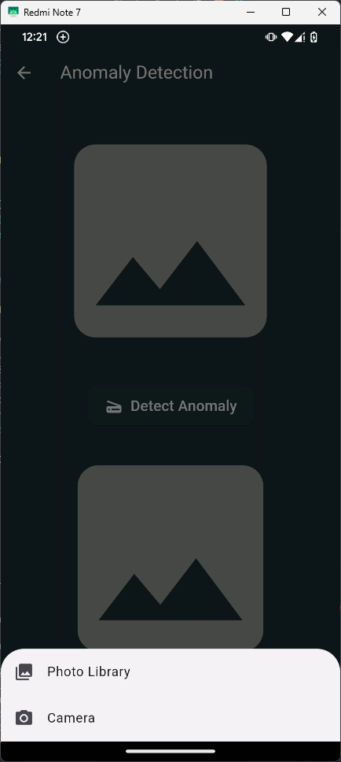
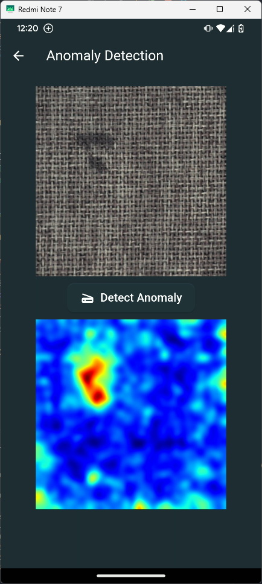
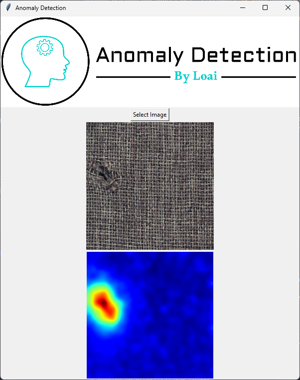
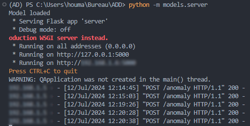

# 2D Anomaly Detection

This project focuses on detecting anomalies in 2D data using advanced machine learning models. It leverages the power of PyTorch for model training and Flutter for creating a cross-platform application that allows users to interact with the anomaly detection system.

## 📊 Training the Model

I used the [MVTec AD](https://www.mvtec.com/company/research/datasets/mvtec-ad/) dataset, which is specifically designed for benchmarking anomaly detection methods. The dataset contains over 5,000 high-resolution images divided into 15 different object and texture categories. Each category has normal images and images with various defects, making it ideal for training and evaluating anomaly detection algorithms.

## ✨ Features

- **Pre-trained Models**: Access pre-trained models like `models/carpet.pt` for quick deployment.


- **📱 Cross-Platform Application**: A Flutter-based application (`anomaly_detection_app_flutter`) for easy interaction with the model.
- **🌐 Server Backend**: A Flask server (`models/server.py`) that serves the model predictions.
- **🖥️ Desktop Application**: A Tkinter-based desktop application for local anomaly detection.

## ⚙️ Installation

To set up the project, follow these steps:

1. Clone the repository to your local machine.
2. Ensure you create a virtual environment first with python version 3.7.1 .

   ```bash
    # Create a new conda environment with Python 3.7.1
    conda create --name myenv python=3.7.1

    # Activate the conda environment
    conda activate myenv
    ```
3. Install the required Python dependencies by running:

    ```bash
    pip install -r requirements.txt 
    ```
4. Download the [backbone](https://opr74a.dm.files.1drv.com/y4mKOuRSNGQQlp6wm_a9bF-UEQwp6a10xFCLhm4bqjDu6aSNW9yhDRM7qyx0vK0WTh42gEaniUVm3h7pg0H-W0yJff5qQtoAX7Zze4vOsqjoIthp-FW3nlfMD0-gcJi8IiVrMWqVOw2N3MbCud6uQQrTaEAvAdNjtjMpym1JghN-F060rSQKmgtq5R-wJe185IyW4-_c5_ItbhYpCyLxdqdEQ) and add the backbone location to `ADD/models/hrnet/hrnet.py` at line 12.
5. Download the pre-trained model and place it in the `models` folder.
6. Navigate to the `anomaly_detection_app_flutter` directory and run the following command to install Flutter dependencies for the mobile application:
    ```bash
    flutter pub get
    ```

## 🚀 Usage

### 📱 For Mobile Application

1. To start the server, navigate to the `ADD` directory and run:
    ```bash
    $env:KMP_DUPLICATE_LIB_OK="TRUE"
    python -m models.server
    ```
2. To run the Flutter application, navigate to the `anomaly_detection_app_flutter` directory and execute:
    ```bash
    flutter run
    ```

### 🖥️ For Desktop Application

1. To run the desktop application, navigate to the `ADD` directory and execute:
    ```bash
    $env:KMP_DUPLICATE_LIB_OK="TRUE"
    python -m models.test
    ```

## 📷 Screenshots

### Mobile Application







### Desktop Application



### Server



## 📜 License

This project is licensed under the MIT License - see the `LICENSE` file for details.

## 💘 Acknowledgements

- Thanks to the Flutter and PyTorch communities for their invaluable resources.
- Special thanks to the [CDO Project](https://github.com/caoyunkang/CDO) team for their pioneering work.